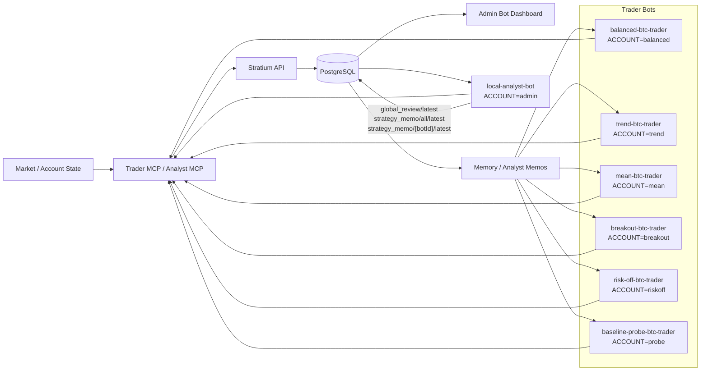

# Stratium Bots

Reference: [AI Trader Memory Governance](docs/ai-trader-memory-governance.md)

## Flow



## Seed

```bash
make db-seed
```

## Accounts

| Account | Password | Bot id | 特性 |
| --- | --- | --- | --- |
| `balanced` | `demo123456` | `balanced-btc-trader` | 均衡型，要求清晰 setup，小仓位学习。 |
| `trend` | `demo123456` | `trend-btc-trader` | 趋势跟随，偏突破延续和回踩顺势。 |
| `mean` | `demo123456` | `mean-btc-trader` | 均值回归，偏 RSI 极值和过度延伸修复。 |
| `breakout` | `demo123456` | `breakout-btc-trader` | 突破型，偏波动扩张和关键位突破。 |
| `riskoff` | `demo123456` | `risk-off-btc-trader` | 防守型，只做减仓、平仓、撤单和观察。 |
| `probe` | `demo123456` | `baseline-probe-btc-trader` | 诊断型，用于验证执行链路和 dashboard。 |
| `admin` | `admin123456` | `local-analyst-bot` | 分析师，复盘多 bot 并下发 strategy memo。 |

## Trader Bots

```bash
make trader-bot-run ACCOUNT=balanced PASSWORD=demo123456 BOT_ID=balanced-btc-trader TRADER_BOT_MODE=paper_execute TRADER_BOT_PLANNER=codex TRADER_BOT_SYMBOL=BTC-USD
```

```bash
make trader-bot-run ACCOUNT=trend PASSWORD=demo123456 BOT_ID=trend-btc-trader TRADER_BOT_MODE=paper_execute TRADER_BOT_PLANNER=codex TRADER_BOT_SYMBOL=BTC-USD TRADER_BOT_SIGNAL_REVIEW_MS=45000
```

```bash
make trader-bot-run ACCOUNT=mean PASSWORD=demo123456 BOT_ID=mean-btc-trader TRADER_BOT_MODE=paper_execute TRADER_BOT_PLANNER=codex TRADER_BOT_SYMBOL=BTC-USD TRADER_BOT_SIGNAL_REVIEW_MS=60000 TRADER_BOT_RISK_RETRY_MS=60000
```

```bash
make trader-bot-run ACCOUNT=breakout PASSWORD=demo123456 BOT_ID=breakout-btc-trader TRADER_BOT_MODE=paper_execute TRADER_BOT_PLANNER=codex TRADER_BOT_SYMBOL=BTC-USD TRADER_BOT_SIGNAL_REVIEW_MS=30000 TRADER_BOT_OPEN_ORDER_REVIEW_MS=60000
```

```bash
make trader-bot-run ACCOUNT=riskoff PASSWORD=demo123456 BOT_ID=risk-off-btc-trader TRADER_BOT_MODE=reduce_only TRADER_BOT_PLANNER=codex TRADER_BOT_SYMBOL=BTC-USD TRADER_BOT_WAKE_INTERVAL_MS=300000
```

```bash
make trader-bot-run-once ACCOUNT=probe PASSWORD=demo123456 BOT_ID=baseline-probe-btc-trader TRADER_BOT_MODE=paper_execute TRADER_BOT_PLANNER=baseline TRADER_BOT_SYMBOL=BTC-USD
```

## Analyst Bot

```bash
make analyst-bot-run ANALYST_ACCOUNT=admin ANALYST_PASSWORD=admin123456 ANALYST_BOT_ID=local-analyst-bot ANALYST_BOT_REVIEW_INTERVAL_MS=1800000 ANALYST_BOT_MAX_BOTS=6
```

```bash
make analyst-bot-run-once ANALYST_ACCOUNT=admin ANALYST_PASSWORD=admin123456 ANALYST_BOT_ID=local-analyst-bot ANALYST_BOT_MAX_BOTS=6
```
