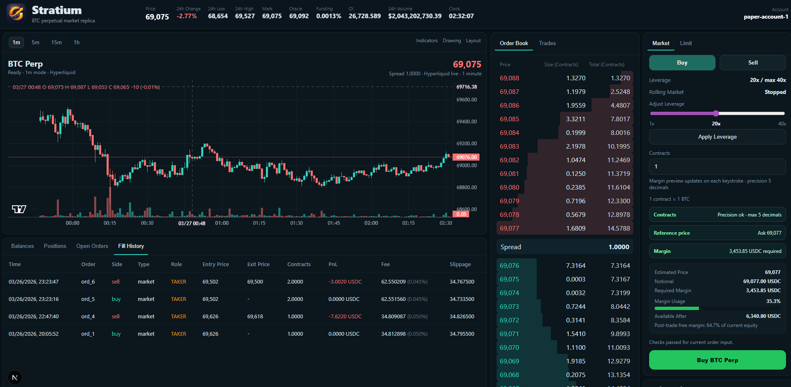

# Stratium



Stratium is a PH1 trading simulation platform focused on a deterministic trading core, a Fastify API, and a basic Web trading UI.

## What It Does

- simulates a single-account, single-symbol trading session
- accepts manual ticks, market orders, limit orders, and cancel requests
- updates orders, position, account, margin, and replayable event history
- exposes state through REST and WebSocket
- supports simulator market data and Hyperliquid-backed market data
- stores trading state and market snapshots in PostgreSQL

## Architecture

```text
                    +----------------------+
                    |   Hyperliquid /      |
                    |   Simulator Feed     |
                    +----------+-----------+
                               |
                               v
                    +----------+-----------+
                    |   apps/api           |
                    | runtime coordinator  |
                    | trading-runtime      |
                    | market-runtime       |
                    | websocket-hub        |
                    +----+------------+----+
                         |            |
             REST / WS   |            | persist / load
                         v            v
                  +------+----+   +---+----------------+
                  | apps/web  |   | PostgreSQL         |
                  | Next.js UI|   | events + snapshots |
                  +-----------+   +---+----------------+
                                       ^
                                       |
                            +----------+-----------+
                            | packages/trading-core|
                            | deterministic engine |
                            +----------------------+
```

## Key Make Commands

```bash
make help
make install
make db-migrate MIGRATION_NAME=add-auth-access
make db-seed
make db-bootstrap
make dev
make up
make up-build
make down
make logs
make check
```

## Demo Accounts

Run `make db-seed` or `make db-bootstrap` before first login. Database setup commands run inside the batch container.

```text
Frontend login
  username: demo
  password: demo123456

Admin login
  username: admin
  password: admin123456
```

### Batch / Market Data

```bash
make batch-build
make batch-run-collector
make batch-clear-kline COIN=BTC INTERVAL=1m
make batch-import-hl-day COIN=BTC DATE=2026-04-08
make batch-refresh-hl-day COIN=BTC DATE=2026-04-08
```

Batch is docker-job only:

- `job-runner` is part of the main compose stack and stays resident
- `batch` itself is not part of the main `api/web/db/job-runner` stack
- it does not auto-start
- run every batch task through the host-side `job-runner`
- `admin -> api -> job-runner -> docker-compose batch`
- `make -> job-runner -> docker-compose batch`

## Main Docs

- [PH1 Architecture](docs/ph1-architecture.md)
- [Data Flow](docs/data-flow.md)
- [Event Spec](docs/event-spec.md)
- [Order Rules](docs/order-rules.md)
- [Margin Rules](docs/margin-rules.md)
