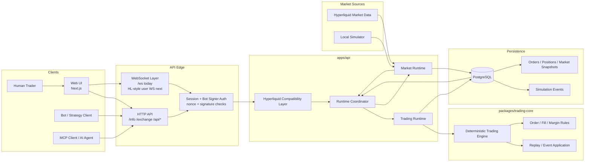

# Stratium


Stratium is a PH1 trading simulation platform focused on a deterministic trading core, a Fastify API, and a basic Web trading UI.

## What It Does

- simulates a single-account, single-symbol trading session
- accepts manual ticks, market orders, limit orders, and cancel requests
- updates orders, position, account, margin, and replayable event history
- exposes state through REST and WebSocket
- supports simulator market data and Hyperliquid-backed market data
- stores trading state and market snapshots in PostgreSQL

## Architecture



Interaction summary:

- Human users operate through the Web UI.
- Bots and future MCP clients use the Hyperliquid-compatible API surface.
- The API layer handles session auth for humans and signer + nonce auth for bot-style flows.
- `apps/api` coordinates trading state, market state, compatibility behavior, and websocket delivery.
- `packages/trading-core` remains the deterministic source of trading behavior.
- PostgreSQL stores event history and query-oriented snapshots for replay and state hydration.

## Key Make Commands

```bash
make help
make install
make db-migrate MIGRATION_NAME=add-auth-access
make db-seed
make db-bootstrap
make dev
make up
make up-build
make down
make logs
make check
```

## Production Deployment

Use the production compose stack instead of the dev stack.

```bash
make prod-esm-check
make prod-up-build
```

If this is the first production boot on a new database, run:

```bash
make db-push
make db-bootstrap
```

Useful production commands:

```bash
make prod-logs
make prod-down
```

Production validation:

- Web should run with `next start`, not `next dev`
- API should run from compiled `dist` output, not `tsx watch`
- the Next.js dev `N` indicator should not appear in the UI

Production API routing:

- if Web and API are served behind the same domain / reverse proxy, leave `NEXT_PUBLIC_API_BASE_URL` empty
- if API is served on a separate public domain, set `NEXT_PUBLIC_API_BASE_URL` explicitly, for example `https://api.example.com`
- production public ports can be overridden with `WEB_PORT` and `API_PORT` in `.env`

## Demo Accounts

Run `make db-seed` or `make db-bootstrap` before first login. Database setup commands run inside the batch container.

Online demo:
- https://stratium.weget.jp

```text
Frontend login
  username: demo
  password: demo123456

Admin login
  username: admin
  password: admin123456
```

### Batch / Market Data

```bash
make batch-build
make batch-run-collector
make batch-clear-kline COIN=BTC INTERVAL=1m
make batch-import-hl-day COIN=BTC DATE=2026-04-08
make batch-refresh-hl-day COIN=BTC DATE=2026-04-08
```

Batch is docker-job only:

- `job-runner` is part of the main compose stack and stays resident
- `batch` itself is not part of the main `api/web/db/job-runner` stack
- it does not auto-start
- run every batch task through the host-side `job-runner`
- `admin -> api -> job-runner -> docker-compose batch`
- `make -> job-runner -> docker-compose batch`

## Main Docs

- [PH1 Architecture](docs/ph1-architecture.md)
- [Data Flow](docs/data-flow.md)
- [Event Spec](docs/event-spec.md)
- [Order Rules](docs/order-rules.md)
- [Margin Rules](docs/margin-rules.md)
- [Hyperliquid API Compatibility](docs/hyperliquid-api-compatibility.md)
- [MCP Feasibility](docs/mcp-feasibility.md)
- [Hyperliquid + MCP Roadmap](docs/roadmap-hyperliquid-mcp.md)
