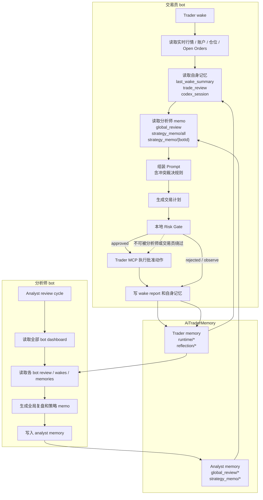
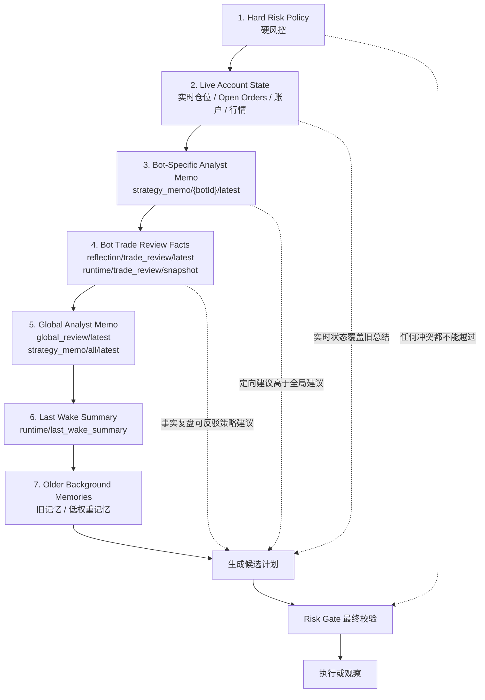
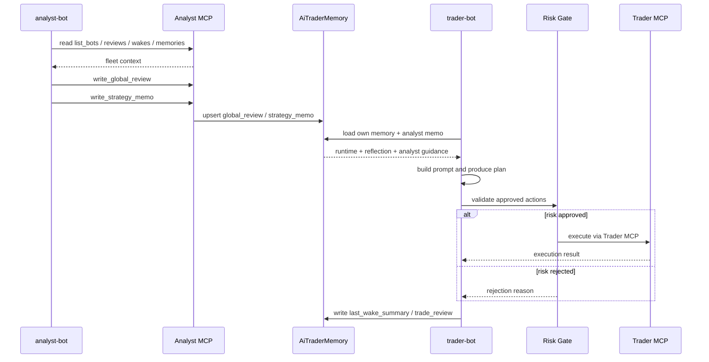

# AI Trader Memory Governance

## 目的

本文定义 Stratium 中交易员 bot 自我总结、分析师 bot 总结、策略 memo、实时交易状态之间的关系。

目标不是让多个 AI 总结彼此覆盖，而是建立一个清晰的分层决策机制：

1. 交易员 bot 保留自己的短期经验和交易事实。
2. 分析师 bot 汇总跨 bot 经验并下发策略建议。
3. 冲突发生时，有确定的优先级和裁决规则。
4. 所有最终交易动作仍必须通过本地风控和交易状态校验。

## 结论

交易员自我总结和分析师总结可以同时存在，但必须被视为不同层级的信息。

推荐规则：

```text
hard risk policy
> live account / position / open orders
> bot-specific analyst memo
> latest bot trade review facts
> global analyst memo
> last wake summary
> stale memories
```

分析师 memo 影响交易员的方式是改变交易员下一次 wake 的上下文和策略倾向，而不是直接执行交易。

## 总体流程图



## 记忆分层

### 1. 实时状态层

来源：

- 当前行情
- 当前账户权益
- 当前仓位
- 当前 open orders
- 当前 risk policy

代表记忆：

- `state/open_orders`

性质：

- 事实状态
- 最短生命周期
- 对交易动作有最高优先级

原则：

如果实时状态和任何总结冲突，以实时状态为准。

例子：

- 分析师建议“等待”，但当前已有高风险仓位接近风控阈值，交易员应优先处理仓位。
- 交易员上次总结说“准备取消订单”，但当前 open orders 中已经没有该订单，不能凭记忆取消。

### 2. 交易员短期自我总结层

来源：

- trader-bot 每次 wake 后自动写入。

代表记忆：

- `runtime/last_wake_summary`

内容：

- wakeId
- wake 状态
- 当时市场价格
- 当时仓位
- plan summary
- selected candidate
- approved / rejected actions
- execution summary
- errors

性质：

- 短期连续性
- 帮助下一次 wake 不重复刚才的动作
- 不是策略上位规则

优先级：

- 低于交易复盘和分析师 memo
- 高于普通旧记忆

### 3. 交易员周期复盘层

来源：

- trader-bot 周期性读取自己的 review snapshot 后写入。

代表记忆：

- `reflection/trade_review/latest`
- `runtime/trade_review/snapshot`
- `runtime/trade_review/last_generated_at`
- `runtime/trade_review/last_wake_count`

当前触发条件：

- 第一次没有复盘时
- 或距离上次复盘超过 `TRADER_BOT_TRADE_REVIEW_INTERVAL_MS`
- 或 Codex wake count 距离上次复盘达到 `TRADER_BOT_TRADE_REVIEW_MIN_WAKES`

默认配置：

- `TRADER_BOT_TRADE_REVIEW_INTERVAL_MS=1800000`
- `TRADER_BOT_TRADE_REVIEW_MIN_WAKES=25`

内容：

- PnL
- equity delta
- realized / unrealized PnL
- win / loss steps
- order stats
- market vs limit fills
- fee
- slippage
- current position
- observations

性质：

- 交易员自己的事实复盘
- 是事实证据，不是高层策略命令
- 分析师和交易员都应该尊重

### 4. Codex session rollover 总结层

来源：

- trader-bot 使用 Codex resume session 时，达到最大 wake 数后生成。

代表记忆：

- `runtime/codex_session/id`
- `runtime/codex_session/wake_count`
- `runtime/codex_session/summary`

当前默认：

- `TRADER_BOT_CODEX_SESSION_MAX_WAKES=40`

性质：

- 防止单个 Codex session 上下文无限增长
- 保留跨 session 的最小连续性
- 不能覆盖实时状态和风险规则

### 5. 分析师全局总结层

来源：

- analyst-bot 周期性读取多个 bot 的 dashboard、review、wakes、memories 后写入。

代表记忆：

- `global_review/latest`
- `strategy_memo/all/latest`

存储位置：

- `botId="__analyst__"`
- `accountId="__global__"`

性质：

- 跨 bot 经验
- 全局策略倾向
- 对所有 trader-bot 可见

适合内容：

- 全体 bot 是否在亏损
- 是否交易过频
- 是否手续费和滑点吞噬收益
- 是否过度 market order
- 是否应该降低 wake 后交易欲望
- 是否应该优先 limit order

不适合内容：

- 直接要求某个 bot 立刻下单
- 绕过 risk policy
- 使用不存在的 order id
- 使用和当前状态无关的固定指令

### 6. 分析师定向策略 memo 层

来源：

- analyst-bot 对单个 bot 写入。

代表记忆：

- `strategy_memo/{botId}/latest`

性质：

- 比全局 memo 更具体
- 高于全局 memo
- 仍然低于实时状态和硬风控

适合内容：

- 某个 bot 当前策略是否应该暂停
- 某个 bot 是否应该减少 market probe
- 某个 bot 是否应该只做趋势跟随
- 某个 bot 是否应该只观察直到胜率恢复

## 冲突类型

### 类型 A：分析师建议和实时状态冲突

例子：

- 分析师 memo：`保持观望，减少交易`
- 实时状态：已有亏损仓位，接近风险阈值

裁决：

实时仓位和账户风险优先。交易员可以执行 reduce / close，而不是机械观望。

### 类型 B：分析师建议和交易员自我复盘冲突

例子：

- 分析师 memo：`可以尝试趋势突破`
- 交易员 trade review：最近突破交易连续亏损、成本过高

裁决：

如果 trade review 提供了明确的近期负反馈，交易员应降低执行强度，并在 `riskNotes` 中说明冲突。

### 类型 C：全局 memo 和定向 memo 冲突

例子：

- 全局 memo：`所有 bot 降低交易频率`
- 定向 memo：`local-demo-trader 可以在 RSI 重置后小仓位试单`

裁决：

定向 memo 优先，但只能在实时状态和风控允许时执行。

### 类型 D：旧 memo 和新 memo 冲突

例子：

- 旧 memo：`优先做 market probe`
- 新 memo：`暂停 market probe`

裁决：

按 `updatedAt` 取新 memo。旧 memo 只作为背景，不作为当前指令。

### 类型 E：总结和硬风控冲突

例子：

- 任意 memo：`加仓`
- risk policy：超过 `maxPositionNotional`

裁决：

硬风控永远最高。risk gate 必须拒绝。

## 统一优先级

交易员在每次 wake 时应按以下顺序理解上下文：



1. **Hard Risk Policy**
   - max order notional
   - max position notional
   - allowed symbols
   - reduce-only / disabled mode
   - invalidation requirement

2. **Live Account State**
   - current position
   - open orders
   - equity
   - available margin
   - current market snapshot

3. **Bot-Specific Analyst Memo**
   - `strategy_memo/{botId}/latest`

4. **Bot Trade Review Facts**
   - `reflection/trade_review/latest`
   - `runtime/trade_review/snapshot`

5. **Global Analyst Memo**
   - `global_review/latest`
   - `strategy_memo/all/latest`

6. **Last Wake Summary**
   - `runtime/last_wake_summary`

7. **Older Background Memories**
   - lower importance or stale runtime memories

## 分析师如何影响交易员

分析师不会直接下单。

分析师影响交易员的路径是：



```text
analyst-bot
  -> reads all bot reviews / wakes / memories
  -> writes global_review/latest
  -> writes strategy_memo/all/latest
  -> optionally writes strategy_memo/{botId}/latest
  -> trader-bot loads these memories next wake
  -> prompt includes analyst guidance
  -> planner produces a plan
  -> local risk gate validates actions
  -> approved actions execute through Trader MCP
```

因此，分析师的影响是：

- 改变交易员的判断倾向
- 改变交易频率
- 改变入场条件要求
- 改变 order type 偏好
- 改变是否继续探索
- 改变是否暂停某类策略

分析师不能：

- 直接 place order
- 直接 cancel order
- 直接 close position
- 绕过 trader-bot planner
- 绕过 risk gate

## Trader Prompt 必须包含的冲突裁决规则

建议将以下规则固定放入 trader-bot prompt：

```text
Memory priority and conflict policy:

1. Hard risk policy is binding and always wins.
2. Live account state, current position, open orders, and current market data win over all memories.
3. Bot-specific analyst memo strategy_memo/{botId}/latest is higher priority than global analyst memo.
4. Latest bot trade review facts are higher priority than broad global guidance.
5. Global analyst guidance is a strategic bias, not an execution command.
6. runtime/last_wake_summary is short-term continuity only.
7. If memories conflict, explain the conflict in riskNotes and choose the safer action.
8. Never invent order ids or act on stale order memory.
9. If analyst guidance recommends caution and local review also shows negative reward or high cost, reduce trading frequency and require a higher-quality setup.
10. If analyst guidance recommends trading but risk, position, order state, or recent review is unfavorable, observe or reduce risk instead.
```

## Analyst Prompt 必须包含的边界规则

建议将以下规则固定放入 analyst-bot prompt：

```text
You are an analyst, not an execution trader.

You may write:
- global_review/latest
- strategy_memo/all/latest
- strategy_memo/{botId}/latest

You must not:
- request direct order placement
- request direct order cancellation
- request direct position close
- override risk policy
- write instructions that depend on unknown order ids

When writing strategy memos:
- distinguish global lessons from bot-specific instructions
- include why the memo exists
- include what behavior should change
- prefer safer behavior when evidence is mixed
- keep memos concise enough for trader prompts
```

## Memo 写作规范

### Global Review

Key:

- `global_review/latest`

推荐格式：

```json
{
  "summary": "cross-bot lesson",
  "evidence": ["PnL curve", "cost stats", "order mix"],
  "recommendedBias": "reduce_frequency | prefer_limit | pause_exploration | allow_selective_entries",
  "riskWarnings": ["..."],
  "updatedAt": "ISO timestamp"
}
```

### Global Strategy Memo

Key:

- `strategy_memo/all/latest`

推荐内容：

- 当前全局交易原则
- 所有 bot 应遵守的探索边界
- 是否鼓励或抑制开仓

### Bot-Specific Strategy Memo

Key:

- `strategy_memo/{botId}/latest`

推荐内容：

- 该 bot 最近主要问题
- 下个阶段应该改变的行为
- 是否暂停某类交易
- 是否限制到某些 setup

## 示例

### 示例 1：分析师抑制过度交易

Analyst memo:

```text
strategy_memo/all/latest:
最近全体 bot 的损失主要来自 market fill 成本和连续下跌步骤。下一阶段应降低交易频率，只在趋势和波动结构明确时小仓位交易，优先限价，避免为了产生反馈而试单。
```

Trader-bot 下一次 wake：

- 如果没有仓位、没有清晰 setup：observe
- 如果有高风险仓位：reduce / close
- 如果有明确 setup：小仓位、限价优先、必须写明 invalidation

### 示例 2：定向 memo 覆盖全局 memo

Global memo:

```text
所有 bot 降低交易频率。
```

Bot-specific memo:

```text
local-demo-trader 可在 RSI 重置到 45-55 且 spread 正常时做极小限价试单。
```

Trader-bot 裁决：

- 对 `local-demo-trader`，定向 memo 可以放宽条件。
- 但如果实时 spread 过宽或账户已有仓位，则不执行。

### 示例 3：trade review 反驳 analyst memo

Analyst memo:

```text
尝试突破交易。
```

Trade review:

```text
过去 25 次 wake 中，突破交易 downSteps 明显高于 upSteps，market fills 成本过高。
```

Trader-bot 裁决：

- 不直接执行突破交易。
- 在 riskNotes 中说明：分析师建议和近期本地结果冲突。
- 选择 observe，等待更高质量条件。

## 实现建议

### 当前已具备

- trader-bot 每次 wake 写 `runtime/last_wake_summary`
- trader-bot 周期写 `reflection/trade_review/latest`
- trader-bot 周期写 `runtime/trade_review/snapshot`
- Codex session 支持 resume 和 rollover summary
- analyst-bot 可读取多 bot 信息
- analyst-bot 可写 global review 和 strategy memo
- trader-bot 可读取 analyst memo
- risk gate 在执行前最终校验

### 需要补强

1. **Prompt 中显式加入冲突裁决规则**
   - trader-bot prompt 加入统一优先级规则。
   - analyst-bot prompt 加入不得直接下单、不得越权规则。

2. **Memory selection 明确排序**
   - `strategy_memo/{botId}/latest`
   - `reflection/trade_review/latest`
   - `global_review/latest`
   - `strategy_memo/all/latest`
   - `runtime/last_wake_summary`

3. **Dashboard 显示 memo 来源**
   - 显示每条 memo 的 source
   - 显示 analyst / runtime / reflection / manual
   - 显示更新时间

4. **冲突记录**
   - 如果 trader-bot 发现 analyst memo 和 trade review 冲突，应在 plan `riskNotes` 中写出。
   - 未来可落库为 `memory_conflict` 或写入 wake report。

5. **Memo 过期机制**
   - 全局 memo 超过一定时间后降权。
   - 定向 memo 超过一定时间后降权。
   - 建议默认 24 小时后降权，72 小时后只作背景。

## 推荐优先级

### P0

- 在 trader-bot prompt 中加入冲突裁决规则。
- 在 analyst-bot prompt 中加入权限边界规则。
- 保证 risk gate 永远最后执行。

### P1

- Dashboard 显示 analyst memo 和 trader self-review 的来源与更新时间。
- 在 timeline 中把 analyst memo 下发和 trader wake 串起来。

### P2

- 增加 memo TTL / stale 降权。
- 增加冲突检测和冲突记录。

## 最终原则

分析师负责“提高策略质量”。

交易员负责“根据当前账户和行情执行或不执行”。

风控负责“决定什么永远不能做”。

三者不能互相替代。
