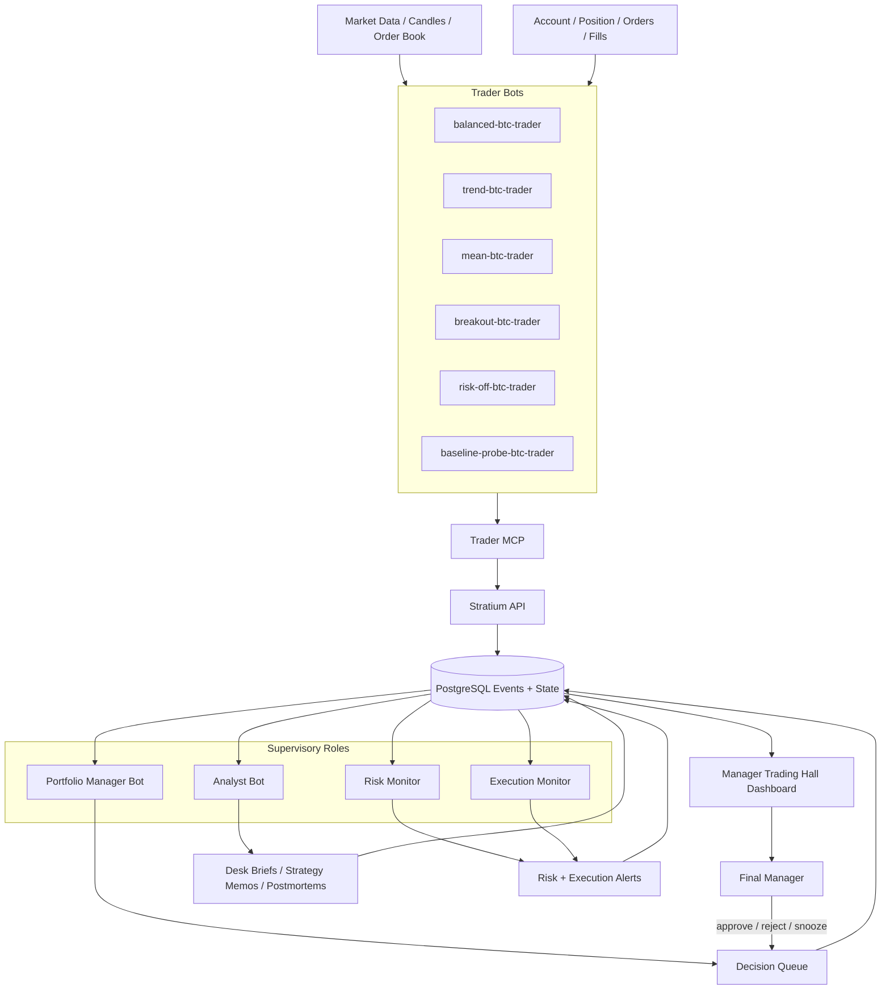

# AI Trading Hall Design Draft

Last updated: 2026-05-21

Status: review draft

Related:

- [AI Trading Hall Manager Intelligence Plan](ai-trading-hall-manager-intelligence-plan.md)
- [AI Trader Memory Governance](ai-trader-memory-governance.md)
- [AI Trader Admin Dashboard And Wake Plan](ai-trader-admin-dashboard-and-wake-plan.md)
- [Stratium Bots](../bots.md)

## 1. Goal

Build a manager-facing AI trading hall for Stratium.

The current dashboard is useful for bot debugging, but the manager still does not get enough actionable intelligence. The new design should answer:

- Is the desk safe?
- Is the desk profitable?
- Which role is not doing its job?
- Which trader bot should be paused, reduced, or promoted?
- Did the analyst review the latest trades?
- Did risk or execution monitoring catch important issues?
- What decision is recommended now?
- What evidence supports the recommendation?

The first screen should be a manager cockpit, not a raw bot log viewer.

## 2. Visual Concept


The image above is a concept reference, not the final UI. The final UI should follow the existing Stratium admin visual language, with dense operational information and restrained status colors.

## 3. Role Configuration

Recommended first version:

| Role | Count | Owner | Purpose |
| --- | ---: | --- | --- |
| Final Manager | 1 | Human manager | Reviews status, accepts or rejects decisions |
| Portfolio Manager Bot | 1 | AI | Compares bots and proposes allocation or mode changes |
| Risk Monitor | 1 | Deterministic service first | Detects exposure, drawdown, stale data, and hard breaches |
| Execution Monitor | 1 | Deterministic service first | Detects invalid fills, slippage, fees, and order quality issues |
| Analyst Bot | 1 | AI | Writes post-trade reviews, desk briefs, and strategy memos |
| Trader Bots | 5 | AI | Balanced, trend, mean, breakout, risk-off |
| Probe Bot | 1 | AI or baseline | Diagnostics only, excluded from strategy leaderboard by default |

Do not start with multiple managers or multiple analysts. The first goal is clear role accountability.

## 4. Operating Model

```text
Trader bots trade.
Risk monitor protects.
Execution monitor validates fill quality.
Analyst bot explains what happened and writes lessons.
Portfolio manager proposes allocation and mode changes.
Final manager sees decisions, evidence, and role health.
```

The manager should not need to inspect every wake unless investigating an incident.

## 5. Flow Diagram



## 6. Page Structure

The manager page should be organized from decision to evidence.

```text
┌────────────────────────────────────────────────────────────────────────────┐
│ Header: Stratium Trading Hall       Status: YELLOW      Last updated       │
├────────────────────────────────────────────────────────────────────────────┤
│ Desk Overview: PnL | Drawdown | Exposure | Alerts | Active Bots | Decisions│
├───────────────────────────────┬────────────────────────────────────────────┤
│ Decision Queue                │ Analyst Brief                              │
│ - recommended actions         │ - what happened                            │
│ - severity / owner / evidence │ - why it happened                          │
│ - approve / reject / snooze   │ - what to watch next                       │
├───────────────────────────────┴────────────────────────────────────────────┤
│ Role Health Matrix                                                         │
│ Risk | Execution | Analyst | Portfolio | Trader Bots                       │
├────────────────────────────────────────────────────────────────────────────┤
│ Strategy Leaderboard                                                       │
│ Bot | Style | Mode | Net PnL | Win Rate | Fees | Drawdown | Recommendation │
├───────────────────────────────┬────────────────────────────────────────────┤
│ Risk Board                    │ Execution Quality Board                    │
│ exposure, margin, losses      │ slippage, fees, limit violations, rejects  │
├────────────────────────────────────────────────────────────────────────────┤
│ Bot Drilldown: timeline, orders, memories, plan, score                     │
└────────────────────────────────────────────────────────────────────────────┘
```

## 7. Screen Modules

### 7.1 Desk Overview

Purpose:

- one-glance desk status
- manager should know whether immediate attention is needed

Fields:

- `deskStatus`: green, yellow, red
- `totalNetPnl`
- `grossPnl`
- `fees`
- `estimatedSlippageCost`
- `maxDrawdown`
- `openExposure`
- `activeAlerts`
- `pendingDecisions`
- `lastAnalystBriefAt`
- `lastTradeClosedAt`

Status rules:

| Status | Meaning |
| --- | --- |
| Green | No active risk alert, analyst fresh, execution quality normal |
| Yellow | Small loss, stale review, repeated losses, or non-critical execution issue |
| Red | Hard risk breach, invalid fill, stale market data with exposure, or severe drawdown |
| Gray | Insufficient data or role not implemented |

### 7.2 Decision Queue

Purpose:

- turn telemetry into manager actions

Decision item fields:

- severity
- owner role
- title
- recommendation
- evidence
- confidence
- deadline
- status: pending, accepted, rejected, snoozed, applied

Example:

```json
{
  "severity": "medium",
  "ownerRole": "portfolio_manager",
  "title": "Pause trend-btc-trader in low-volatility chop",
  "recommendation": "Switch trend-btc-trader to observe until ATR expands or two valid trend signals appear.",
  "evidence": [
    "trend-btc-trader closed 2 losing trades",
    "latest analyst memo says BTC-USD is choppy",
    "fees consumed a large part of realized loss"
  ],
  "confidence": 0.72,
  "status": "pending"
}
```

Actions:

- accept
- reject
- snooze
- inspect evidence
- open bot drilldown

### 7.3 Analyst Brief

Purpose:

- show a readable desk-level narrative
- separate strategy loss, execution loss, and risk loss

Required sections:

- summary
- what changed
- affected bots
- root cause
- recommendation
- watch next

Freshness rule:

- stale if no update after a trade close
- stale if older than configured formal review interval

### 7.4 Role Health Matrix

Purpose:

- make each role accountable

Rows:

- Risk Monitor
- Execution Monitor
- Analyst Bot
- Portfolio Manager Bot
- Trader Bots
- Probe Bot

Columns:

- status
- last action
- expected cadence
- freshness
- current issue
- next required output

Example:

| Role | Status | Last action | Freshness | Issue | Next output |
| --- | --- | --- | --- | --- | --- |
| Risk Monitor | green | no breach | fresh | none | next scan |
| Execution Monitor | red | limit violation found | fresh | bad fill sample | incident record |
| Analyst Bot | yellow | old brief | stale | missed latest closed trades | post-trade review |
| Portfolio Manager | gray | not implemented | missing | no allocation decision | decision proposal |
| Trader Bots | yellow | 5 active bots | fresh | trend and breakout losing | continue with reduced risk |

### 7.5 Strategy Leaderboard

Purpose:

- compare trader bot styles
- exclude diagnostics from performance decisions

Rows:

- balanced
- trend
- mean
- breakout
- risk-off

Probe bot is hidden by default.

Columns:

- style
- mode
- net PnL
- gross PnL
- fees
- slippage
- win rate
- average trade PnL
- max drawdown
- last trade
- latest memo
- recommendation

### 7.6 Risk Board

Purpose:

- show whether the desk is safe

Metrics:

- total exposure
- exposure by direction
- exposure by account
- margin usage
- unrealized PnL
- realized PnL
- consecutive losses
- drawdown
- open order age
- stale market data
- forced mode changes

### 7.7 Execution Quality Board

Purpose:

- prevent invalid simulator or broker feedback from training the AI

Metrics:

- limit price violations
- market order ratio
- maker vs taker ratio
- average slippage
- total fees
- fee as percentage of gross PnL
- order rejection rate
- cancel success rate
- fill latency

Important:

- execution quality red should affect all strategy evaluations
- contaminated samples should be labeled before analyst uses them

### 7.8 Bot Drilldown

Purpose:

- investigation view
- existing Bot Dashboard mostly belongs here

Sections:

- PnL curve
- win rate
- order history
- wake timeline
- current strategy
- plan
- score
- memory cards
- analyst memo
- execution results

## 8. Required Data Objects

### 8.1 Desk Brief

```json
{
  "schemaVersion": "stratium.desk-brief.v1",
  "status": "yellow",
  "summary": "Desk lost small amount in low-volatility chop; execution samples before the pricing fix are contaminated.",
  "keyFindings": [],
  "recommendedActions": [],
  "riskAlerts": [],
  "generatedAt": "2026-05-21T00:00:00.000Z"
}
```

### 8.2 Role Health

```json
{
  "schemaVersion": "stratium.role-health.v1",
  "role": "analyst",
  "status": "stale",
  "lastActionAt": "2026-05-21T00:00:00.000Z",
  "expectedCadence": "post_trade_or_15m",
  "missingDuties": ["post_trade_review"]
}
```

### 8.3 Manager Decision

```json
{
  "schemaVersion": "stratium.manager-decision.v1",
  "severity": "medium",
  "ownerRole": "portfolio_manager",
  "title": "Pause trend-btc-trader until next regime shift",
  "recommendation": "Switch to observe for 30 minutes or until ATR expands.",
  "evidence": [],
  "confidence": 0.72,
  "status": "pending"
}
```

### 8.4 Trade Postmortem

```json
{
  "schemaVersion": "stratium.trade-postmortem.v1",
  "tradeId": "trade-001",
  "botId": "trend-btc-trader",
  "symbol": "BTC-USD",
  "openedAt": "2026-05-21T00:00:00.000Z",
  "closedAt": "2026-05-21T00:10:00.000Z",
  "netPnl": -0.12,
  "grossPnl": -0.07,
  "fees": 0.05,
  "classification": "strategy_loss",
  "rootCause": "Entered trend setup during low-volatility chop.",
  "lesson": "Trend bot should wait for volatility expansion or confirmed continuation.",
  "nextRuleCandidate": "Require ATR expansion before trend entries."
}
```

### 8.5 Execution Alert

```json
{
  "schemaVersion": "stratium.execution-alert.v1",
  "severity": "critical",
  "type": "limit_price_violation",
  "orderId": "ord_1",
  "botId": "breakout-btc-trader",
  "message": "Limit buy filled above limit price.",
  "sampleContaminated": true,
  "createdAt": "2026-05-21T00:00:00.000Z"
}
```

## 9. Implementation Phases

### Phase 1: Manager Dashboard Shell

Build UI shell and API aggregate payload:

- Desk Overview
- Role Health Matrix
- Decision Queue
- Analyst Brief
- Strategy Leaderboard
- Risk Board
- Execution Quality Board
- Bot Drilldown entry

This phase may derive fields from existing data.

### Phase 2: Structured Intelligence Persistence

Add persistence for:

- desk briefs
- role health snapshots
- manager decisions
- execution alerts
- trade postmortems

### Phase 3: Post-Trade Review

Add event-driven review:

- detect position closed
- create stable `tradeId`
- write postmortem
- update trader memory
- notify analyst review queue

### Phase 4: Risk And Execution Monitors

Add deterministic services:

- risk scanning
- execution quality checks
- alert generation
- contaminated sample labeling

### Phase 5: Portfolio Manager

Add portfolio manager bot:

- reads bot reviews and analyst memos
- writes decision proposals
- recommends mode and budget changes

### Phase 6: Manager Workflow

Add controls:

- accept
- reject
- snooze
- apply recommendation
- audit trail

## 10. Acceptance Criteria

The design is successful if the manager can answer these in under one minute:

1. What is the desk status?
2. Which role needs attention?
3. Which bot is helping or hurting?
4. Was the latest loss strategic, execution-related, or risk-related?
5. What did the analyst conclude?
6. What action is recommended now?
7. What evidence supports that recommendation?

## 11. Open Questions For Review

1. Should Risk Monitor and Execution Monitor be separate services, or one deterministic supervisor in the first version?
2. Should Portfolio Manager be implemented before or after structured post-trade reviews?
3. What is the minimum data needed to create a reliable `tradeId` from current orders and fills?
4. Should contaminated historical trades be excluded from all bot score calculations by default?
5. Should manager decisions directly change bot modes, or should they only write strategy memos at first?
6. How should the dashboard distinguish insufficient sample size from poor strategy quality?
7. What thresholds should define green, yellow, and red desk status?

## 12. AI Review Prompt

Use this prompt when asking another AI to review the design:

```text
Please review this Stratium AI Trading Hall design draft as a senior product architect and trading systems reviewer.

Context:
- Stratium is a closed-loop simulated trading platform.
- It runs multiple AI trader bots through Trader MCP.
- There is one analyst bot today, but the manager dashboard does not yet provide decision-grade intelligence.
- The goal is to simulate a realistic trading company with trader bots, analyst bot, risk monitor, execution monitor, portfolio manager, and final manager dashboard.

Review goals:
1. Identify whether the role split is clear and realistic.
2. Identify missing information the final manager would need.
3. Evaluate whether the dashboard layout is useful or too complex.
4. Evaluate whether the proposed data objects are sufficient.
5. Point out any overengineering for the current Stratium stage.
6. Recommend the best implementation order.
7. Suggest concrete improvements to the first version.

Please provide:
- top 5 strengths
- top 5 risks or gaps
- recommended MVP scope
- data model changes needed
- dashboard UX improvements
- final recommendation: approve, revise, or reject
```

