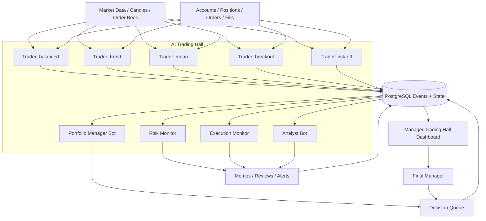

# AI Trading Hall Manager Intelligence Plan

Last updated: 2026-05-21

## Purpose

This document defines the next target for Stratium's AI trading system: an effective trading hall where each role has a clear job, every important decision is observable, and the final manager gets decision-grade intelligence instead of raw bot logs.

Related documents:

- [AI Trader Memory Governance](ai-trader-memory-governance.md)
- [AI Trader Admin Dashboard And Wake Plan](ai-trader-admin-dashboard-and-wake-plan.md)
- [AI Trader Strategy Package](ai-trader-strategy-package.md)
- [Stratium Bots](../bots.md)

## Problem

The current admin Bot Dashboard proves that the technical loop works:

- trader bots wake
- plans are generated
- orders can be placed, canceled, and closed
- memories and wake reports are persisted
- PnL, orders, and timeline can be displayed

But it is still closer to a bot debug console than a trading hall.

As the final manager, the user cannot quickly answer:

- Are we making or losing money for the right reasons?
- Which bot should be paused, reduced, or given more budget?
- Did the analyst notice the latest trade outcomes?
- Did the risk role intervene when it should have?
- Are traders following their assigned style?
- Which hypothesis is currently being tested?
- What changed since the last review?
- What action, if any, should the manager take now?

The next dashboard must turn raw events into operating intelligence.

## Design Principle

The trading hall should model a real trading company, not only a group of autonomous bots.

Core rule:

```text
Trader bots react to market and position events.
Risk monitors react to risk breaches.
Analyst bots react to trade outcomes.
Portfolio managers react to multi-bot performance.
The final manager receives concise decisions, alerts, and evidence.
```

Time intervals should not be arbitrary. They should come from role responsibility and strategy timeframe.

For the current BTC-USD 1m simulation:

- position review is faster because open risk changes every candle
- order review is slower because stale orders need context, not tick noise
- analyst review is event-driven after closes, with periodic summaries as a backstop
- portfolio changes are slower because allocation should not churn after every small sample

## Target Roles

### Final Manager

Purpose:

- oversee the whole desk
- approve structural changes
- stop bad experiments
- promote useful strategies

Manager should see:

- desk status: green, yellow, red
- total PnL, drawdown, win rate, fees, slippage
- active risk alerts
- role health
- strategy leaderboard
- current analyst conclusion
- action queue requiring manager decision

Manager should not need to read every wake unless investigating a specific incident.

### Portfolio Manager Bot

Purpose:

- allocate or reduce risk budget across trader bots
- decide whether a bot is active, observe-only, reduce-only, or disabled
- compare strategies across the same market regime

Inputs:

- all bot reviews
- PnL and drawdown by bot
- win rate and cost by strategy style
- correlation of active positions
- analyst memos
- risk alerts

Outputs:

- `portfolio_decision/latest`
- bot mode recommendations
- risk budget recommendations
- strategy promotion or pause recommendations

Cadence:

- every 1-4 hours in simulation by default
- immediately after major risk events
- not after every single trade

### Risk Monitor

Purpose:

- protect accounts and experiments from bad execution, excessive loss, and broken assumptions
- escalate or force safe mode when deterministic limits are breached

Inputs:

- positions
- open orders
- realized and unrealized PnL
- drawdown
- order rejection rate
- market data freshness
- execution latency
- slippage and fee spikes
- repeated invalid actions

Outputs:

- `risk_alert/*`
- bot mode override proposals
- forced reduce-only or disabled state for severe cases
- incident log

Cadence:

- event-driven
- scan every 30-60 seconds while any bot has exposure
- scan every 2-5 minutes when all bots are flat

The risk monitor should not wait for an LLM when hard limits are breached.

### Analyst Bot

Purpose:

- convert trade outcomes into lessons
- compare bots
- explain why recent performance changed
- write strategy memos that traders consume on the next wake

Inputs:

- closed trades
- wake timeline
- order and fill history
- trader memories
- PnL, fees, slippage, drawdown
- market regime at entry and exit

Outputs:

- `global_review/latest`
- `strategy_memo/all/latest`
- `strategy_memo/{botId}/latest`
- `trade_postmortem/{tradeId}`
- `desk_brief/latest`

Cadence:

- immediately after a position closes
- immediately after 2-3 consecutive losses by one bot
- immediately when total desk drawdown crosses a threshold
- periodic light scan every 5-15 minutes
- formal desk review every 30-60 minutes

The analyst should not place trades. It changes context and strategy guidance.

### Trader Bot

Purpose:

- operate one trading style
- manage its own positions and orders
- produce plans and actions through Trader MCP
- write wake summaries and execution facts

Inputs:

- live market state
- live account, position, and open orders
- own memories
- analyst memo
- risk policy

Outputs:

- wake report
- selected plan
- action result
- last wake memory
- trade thesis

Cadence:

- immediately after fills
- every 30-60 seconds while holding a position
- every 60-120 seconds while it has open orders
- every 3-5 minutes when flat with no orders
- signal-triggered on candle close when relevant

### Execution Monitor

Purpose:

- verify that execution behaved as expected
- detect simulator or broker issues
- separate strategy loss from execution loss

Inputs:

- orders
- fills
- client order ids
- latency
- limit price checks
- slippage
- fee rate
- rejected orders

Outputs:

- execution quality score
- execution anomaly alerts
- per-order quality flags

Examples:

- limit buy filled above limit
- limit sell filled below limit
- high slippage vs recent spread
- repeated cancel failures
- open order not visible after placement

This role is important because bad execution feedback can train the AI incorrectly.

### Probe Bot

Purpose:

- test execution paths and dashboard instrumentation
- avoid mixing diagnostics with real strategy evaluation

Outputs should be clearly marked as diagnostic and excluded from strategy leaderboards by default.

## Role Flow



## Manager Dashboard Information Architecture

### 1. Desk Overview

This is the first screen.

It should answer in 10 seconds:

- are we safe?
- are we profitable?
- what changed?
- who needs attention?

Required blocks:

- desk status: green / yellow / red
- total simulated PnL
- max drawdown
- daily realized PnL
- open exposure
- active alerts
- number of active bots
- bots in reduce-only or disabled mode
- last analyst brief
- pending manager decisions

Example manager brief:

```text
Desk is YELLOW.
Total PnL is -0.72 after 5 closed trades.
Loss is mostly execution cost and limit-fill issue before 14:04 fix.
No open exposure.
Trend and breakout both lost in low-volatility chop.
Recommendation: reset runtime data or mark pre-fix trades as contaminated, then run event-driven post-trade review.
```

### 2. Role Health Matrix

Rows are roles. Columns are duties.

Example:

| Role | Status | Last action | SLA | Output freshness | Issue |
| --- | --- | --- | --- | --- | --- |
| Risk Monitor | green | no breach | realtime | fresh | none |
| Execution Monitor | red | detected bad limit fills | event | fresh | simulator pricing bug |
| Analyst | yellow | old global memo | post-trade | stale | did not review latest closes |
| Portfolio Manager | gray | not implemented | hourly | missing | no allocation decision |
| Trend Trader | yellow | closed losing short | position event | fresh | repeated chop losses |

This is where the manager sees whether each role is doing its job.

### 3. Strategy Leaderboard

Purpose:

- compare bot styles
- prevent one bad bot from being hidden in aggregate metrics

Metrics:

- net PnL
- gross PnL
- fees
- estimated slippage cost
- win rate
- average trade PnL
- max drawdown
- active exposure
- number of trades
- current mode
- latest analyst recommendation

The leaderboard should exclude probe bot by default.

### 4. Decision Queue

This is the most important missing feature.

Dashboard should not only show data; it should produce manager decisions.

Decision examples:

- pause `trend-btc-trader` after 2 chop losses
- keep `risk-off-btc-trader` in reduce-only
- reset contaminated samples before evaluating strategy quality
- reduce all bot order size by 50% while execution quality is red
- promote `mean-btc-trader` to active only after it has 3 valid post-fix samples

Each decision item should include:

- title
- role owner
- severity
- recommended action
- evidence
- confidence
- deadline
- accept / reject / snooze controls

### 5. Analyst Brief

Purpose:

- give the manager a readable desk-level narrative
- explain what the bots learned
- separate market loss from execution loss

Required content:

- what happened
- why it happened
- affected bots
- evidence
- recommended changes
- what to watch next

The analyst brief must be refreshed after closed trades, not only on a long timer.

### 6. Risk Board

Purpose:

- show whether the system is safe
- make hard limits visible

Metrics:

- total exposure
- exposure by symbol
- exposure by direction
- margin usage
- account drawdown
- consecutive losses
- open order age
- stale market data
- rejected action count
- forced mode changes

Risk alerts should be more prominent than PnL charts.

### 7. Execution Quality Board

Purpose:

- avoid training the AI on invalid simulator or broker feedback

Metrics:

- limit price violations
- average slippage
- total fees
- maker vs taker ratio
- market order ratio
- order rejection rate
- cancel success rate
- fill latency

Execution quality should generate red alerts when fill rules are violated.

### 8. Bot Drilldown

The existing Bot Dashboard belongs here.

It should remain available for investigation:

- PnL curve
- win rate
- order history
- wake timeline
- memory cards
- current strategy
- selected plan
- score
- execution results

But it should be second-level, not the manager's primary view.

## Event Model Required For Useful Intelligence

Current wake reports and orders are useful, but manager intelligence needs stronger event semantics.

Recommended event groups:

### Trade Lifecycle

- `trade_opened`
- `trade_scaled`
- `trade_closed`
- `trade_postmortem_written`

Each trade should have a stable `tradeId` linking:

- opening wake
- opening order
- fills
- closing wake
- closing order
- PnL
- fees
- thesis
- invalidation
- analyst postmortem

### Role Activity

- `risk_checked`
- `risk_alert_created`
- `risk_override_applied`
- `analyst_review_started`
- `analyst_review_written`
- `portfolio_decision_proposed`
- `portfolio_decision_applied`
- `execution_anomaly_detected`

### Manager Decision

- `manager_decision_created`
- `manager_decision_accepted`
- `manager_decision_rejected`
- `manager_decision_snoozed`
- `manager_override_applied`

These events make the trading hall auditable.

## Intelligence Objects

The dashboard should not compute everything from raw text memories.

Add structured intelligence objects over time.

### Desk Brief

```json
{
  "schemaVersion": "stratium.desk-brief.v1",
  "status": "yellow",
  "summary": "Desk lost small amount in low-volatility chop; execution samples before pricing fix are contaminated.",
  "keyFindings": [],
  "recommendedActions": [],
  "riskAlerts": [],
  "generatedAt": "2026-05-21T00:00:00.000Z"
}
```

### Role Health

```json
{
  "schemaVersion": "stratium.role-health.v1",
  "role": "analyst",
  "status": "stale",
  "lastActionAt": "2026-05-21T00:00:00.000Z",
  "expectedCadence": "post_trade_or_15m",
  "missingDuties": ["post_trade_review"]
}
```

### Decision Item

```json
{
  "schemaVersion": "stratium.manager-decision.v1",
  "severity": "medium",
  "ownerRole": "portfolio_manager",
  "title": "Pause trend-btc-trader until next regime shift",
  "recommendation": "Switch to observe for 30 minutes or until ATR expands.",
  "evidence": [],
  "confidence": 0.72,
  "status": "pending"
}
```

## Cadence Policy

The cadence should be policy-driven and role-specific.

### Trader Cadence

| State | Trigger |
| --- | --- |
| flat, no orders | heartbeat every 3-5m |
| open orders | review every 60-120s |
| open position | review every 30-60s |
| new fill | immediate wake |
| execution error | immediate wake |
| signal transition | candle close wake |

### Risk Cadence

| State | Trigger |
| --- | --- |
| any exposure | scan every 30-60s |
| all flat | scan every 2-5m |
| hard breach | immediate deterministic action |
| stale data | immediate alert |

### Analyst Cadence

| State | Trigger |
| --- | --- |
| trade closed | immediate postmortem |
| 2-3 consecutive losses | immediate review |
| abnormal fees/slippage | immediate review |
| normal operation | light scan every 5-15m |
| desk review | formal summary every 30-60m |

### Portfolio Cadence

| State | Trigger |
| --- | --- |
| enough new samples | review every 1-4h |
| major drawdown | immediate review |
| strategy promotion | after sufficient valid samples |

## What Makes The Dashboard Useful

The dashboard is useful only if it provides:

1. Current desk status.
2. Explanation of why status changed.
3. Role accountability.
4. Recommended manager actions.
5. Evidence for each recommendation.
6. A path to drill into raw events.

It is not enough to show:

- PnL chart alone
- order table alone
- raw memory text alone
- wake count alone

The manager needs a control surface, not just telemetry.

## Phased Implementation Plan

### Phase 0: Fix Training Feedback Integrity

Status: started.

Required:

- limit order fill prices must obey limit boundaries
- execution monitor should detect invalid fill samples
- dashboard should mark old contaminated samples if they exist

### Phase 1: Manager Trading Hall Page

Build a new admin page or top-level Bot Dashboard mode:

- Desk Overview
- Role Health Matrix
- Decision Queue
- Analyst Brief
- Strategy Leaderboard
- Risk Board
- Execution Quality Board

Use the existing bot drilldown as a secondary panel.

### Phase 2: Post-Trade Review

Add event-driven review:

- generate trade postmortem immediately after position closes
- write `trade_postmortem/{tradeId}`
- update `reflection/trade_review/latest`
- notify analyst bot or schedule analyst review

### Phase 3: Risk Monitor

Add deterministic risk role:

- risk scan service
- risk alert persistence
- forced mode recommendations
- dashboard red/yellow/green states

### Phase 4: Analyst Intelligence Upgrade

Make analyst output structured:

- `desk_brief/latest`
- structured strategy memo
- evidence-linked recommendations
- stale memo detection

### Phase 5: Portfolio Manager

Add portfolio-level role:

- compare bot strategies
- recommend bot mode and budget
- decide when enough samples exist
- support manager accept/reject workflow

### Phase 6: Manager Decision Workflow

Persist manager decisions:

- pending
- accepted
- rejected
- snoozed
- applied

Every applied decision should be visible in the timeline.

## Acceptance Criteria

The trading hall is effective when the final manager can answer these in under one minute:

1. What is the desk status?
2. Which role needs attention?
3. Which bot is helping or hurting?
4. Was the latest loss strategic, execution-related, or risk-related?
5. What did the analyst conclude?
6. What action is recommended now?
7. What evidence supports that recommendation?

## Near-Term Recommendation

Do not continue adding isolated bot cards first.

Next implementation should create the manager-level data model and dashboard shell:

```text
Desk Overview
Role Health Matrix
Decision Queue
Analyst Brief
Strategy Leaderboard
Risk Board
Execution Quality Board
Bot Drilldown
```

Then connect existing wake reports, reviews, orders, fills, and memories into this structure.

