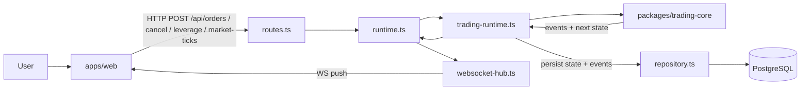
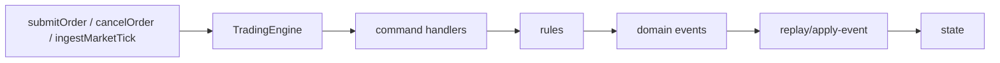
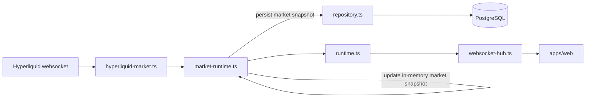
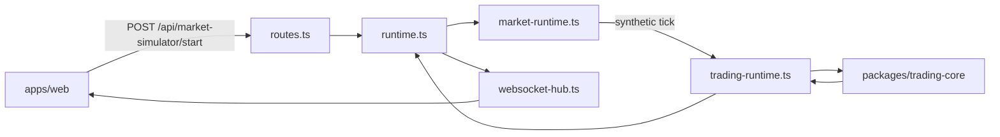
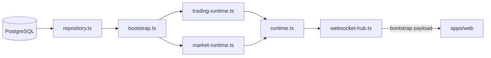
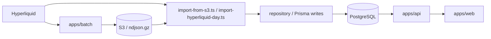

# Data Flow

This document describes the current PH1 data flow across `apps/web`, `apps/api`, `packages/trading-core`, PostgreSQL, and the batch market-data tools.

## 1. Trading Command Flow

### What happens

1. The Web UI sends a trading command to the API.
2. `routes.ts` validates and forwards the request to `runtime.ts`.
3. `runtime.ts` delegates trading work to `trading-runtime.ts`.
4. `trading-runtime.ts` invokes `packages/trading-core`.
5. `trading-core` derives domain events and updated state.
6. `trading-runtime.ts` persists the new state and event log through `repository.ts`.
7. `runtime.ts` builds the websocket payload and passes it to `websocket-hub.ts`.
8. The Web UI receives the updated state and event stream over websocket.

## 2. Trading-Core Internal Flow

### Current module mapping

- `engine/handle-submit-order.ts`
- `engine/handle-cancel-order.ts`
- `engine/handle-market-tick.ts`
- `engine/handle-fill-order.ts`
- `engine/handle-post-fill.ts`
- `engine/handle-refresh-account.ts`
- `rules/order-validation.ts`
- `rules/pricing.ts`
- `rules/position-math.ts`
- `rules/account-math.ts`
- `replay/apply-event.ts`
- `replay/replay-events.ts`

### Intent

- handlers decide which events should happen
- reducers apply those events into canonical state
- replay rebuilds state from the same event semantics

## 3. Market Data Flow

### What happens

1. `hyperliquid-market.ts` receives live book, trades, candles, and asset context.
2. `market-runtime.ts` merges them into in-memory market state.
3. Changed market snapshots are persisted through `repository.ts`.
4. `runtime.ts` broadcasts the latest market payload through `websocket-hub.ts`.
5. The Web UI updates charts, trades, and order book views from websocket state.

## 4. Simulator Flow

### What happens

1. The UI starts the simulator through the API.
2. `market-runtime.ts` generates synthetic ticks on an interval.
3. Each tick is forwarded into `trading-runtime.ts`.
4. `trading-core` updates state exactly like a live market tick path.
5. Updated state is broadcast back to the UI.

## 5. Bootstrap and Replay Flow

### What happens

1. `runtime.ts` starts and opens the repository connection.
2. `bootstrap.ts` loads persisted symbol config, event log, and recent market snapshot.
3. `trading-runtime.ts` rebuilds trading state from persisted events.
4. `market-runtime.ts` restores the in-memory market snapshot.
5. The first websocket connection receives a bootstrap payload with the restored state.

## 6. Batch Historical Market Flow

### What happens

1. The long-running batch service collects Hyperliquid market data and archives it.
2. Import jobs write normalized candles and volume records into PostgreSQL.
3. The API reads persisted historical market data on bootstrap or via history endpoints.
4. The Web UI consumes that historical data for chart initialization.

## Summary

There are two main data loops:

- trading loop: command -> `trading-core` -> events/state -> persistence -> websocket
- market loop: Hyperliquid or simulator -> `market-runtime` -> persistence -> websocket

`runtime.ts` coordinates these loops, but the detailed work is split into dedicated modules so trading, market, persistence, and transport responsibilities stay separated.
