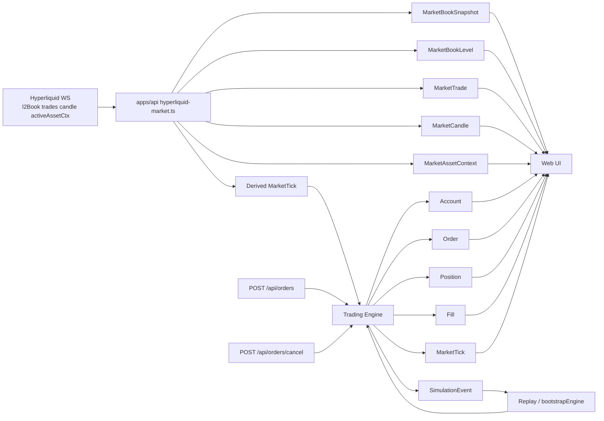

# Data Model Reference

This document explains the responsibilities of the main data tables in the current project, which tables are sources of truth, which ones are projections, and how market data and trading state move through the system.

Useful scenarios:

- investigating replay issues
- clearing data before a clean test run
- understanding why some records reappear after deletion
- deciding which tables are suitable for replay or post-trade analysis

## Table Categories

The current schema can be grouped into four categories:

1. Trading fact tables
   - record what happened
   - primary example: `SimulationEvent`

2. Trading configuration tables
   - store instrument-level configuration
   - primary example: `SymbolConfig`

3. Trading state projection tables
   - store the current state
   - examples: `Account`, `Order`, `Position`, `Fill`

4. Market history tables
   - store Hyperliquid public market data and the price inputs consumed by the local trading engine
   - examples: `MarketTrade`, `MarketCandle`, `MarketVolumeRecord`, `MarketBookSnapshot`, `MarketBookLevel`

## Sources of Truth and Projections

For the trading engine, the main source of truth is:

- `SimulationEvent`

These tables are projected from trading facts or the current engine state:

- `Account`
- `Order`
- `Position`
- `Fill`
- `MarketTick`

This matters because it directly determines whether deleting rows truly resets state:

- deleting only `Order` does not mean the system is actually reset
- as long as `SimulationEvent` still exists, orders may be written back during API startup replay or later persistence

## Data Flow Diagram

## Trading Tables

### `SymbolConfig`

Purpose:

- instrument configuration table
- provides symbol-level config to the local trading engine
- acts as a local cache of official Hyperliquid metadata

Fields aligned with Hyperliquid:

- `assetIndex`
- `coin`
- `symbol`
- `quoteAsset`
- `contractType`
- `contractMultiplier`
- `szDecimals`
- `maxPriceDecimals`
- `maxLeverage`
- `marginTableId`
- `onlyIsolated`
- `marginMode`
- `isDelisted`
- `isActive`
- `baseTakerFeeRate`
- `baseMakerFeeRate`

Local simulation fields:

- `engineDefaultLeverage`
- `engineMaintenanceMarginRate`
- `engineBaseSlippageBps`
- `enginePartialFillEnabled`

Notes:

- official fields are seeded from Hyperliquid `meta`
- local simulation fields are for the current PH1 engine and are not identical to Hyperliquid matching behavior
- on API startup, the service reads the current instrument configuration from this table first

### `SimulationEvent`

Purpose:

- the master trading event log
- the source of truth for replay
- used to rebuild in-memory engine state during API startup

Typical contents:

- order requests
- order acceptance
- order rejection
- order cancellation
- market tick arrival
- order fill
- partial fill
- account and margin updates

Why it matters:

- it explains why the current state looks the way it does
- if you want a real trading-state reset, this table usually needs to be cleared as well

### `Account`

Purpose:

- snapshot of current account state

Typical contents:

- wallet balance
- available balance
- position margin
- order margin
- equity
- realized / unrealized PnL
- risk ratio

Notes:

- this is a current-state table, not a source of truth
- it is persisted from the current engine state

### `Order`

Purpose:

- current order state

Typical contents:

- side
- order type
- status
- quantity
- filled quantity
- remaining quantity
- limit price
- rejection reason

Notes:

- this table is not a source of truth
- deleting it alone does not truly erase order history

### `Fill`

Purpose:

- records actual fill details for orders

Typical contents:

- `orderId`
- fill price
- fill quantity
- fee
- slippage

Notes:

- in a more complete execution model, one order may correspond to multiple `Fill` rows
- the current execution model is still simplified, but this table is still the correct place to inspect actual execution results

### `Position`

Purpose:

- snapshot of the current position state

Typical contents:

- side
- quantity
- average entry price
- mark price
- realized / unrealized PnL
- margin
- liquidation price

Notes:

- current-state table
- persisted from the engine position state

### `LedgerEntry`

Purpose:

- planned account ledger table

Typical scenarios:

- fee deductions
- realized PnL booking
- margin release
- liquidation-related balance changes

Current status:

- the schema exists
- but it is not fully integrated into the current persistence flow

### `LiquidationEvent`

Purpose:

- planned liquidation audit table

Typical contents:

- trigger price
- execution price
- execution quantity
- liquidation order id

Current status:

- the schema exists
- but the full liquidation flow is not fully connected yet

## Market Tables

### `MarketBookSnapshot`

Purpose:

- header record for an order book snapshot at a specific point in time

Typical contents:

- data source
- coin
- symbol
- best bid
- best ask
- spread
- capture time

Useful for:

- checking the top-of-book state at a specific time
- joining with `MarketBookLevel`

### `MarketBookLevel`

Purpose:

- per-level depth rows inside a specific order book snapshot

Typical contents:

- snapshot id
- bid / ask side
- level index
- price
- size
- number of orders at that level

Useful for:

- rebuilding the frontend order book
- inspecting depth structure over a period of time
- order book replay analysis

### `MarketTrade`

Purpose:

- Hyperliquid public trade history

Typical contents:

- buy / sell side
- trade price
- trade size
- trade time

Useful for:

- trade tape
- short-term execution rhythm analysis
- checking whether price moves happened through real trades or only through book movement

### `MarketCandle`

Purpose:

- candlestick history

Typical contents:

- interval
- open time
- close time
- OHLC
- volume
- trade count

Useful for:

- chart rendering
- long-range replay
- quick trend and regime inspection

Current recommendation:

- `1m` is the main historical granularity
- finer detail should be supplemented by continuously synced WebSocket data while the server is online

### `MarketVolumeRecord`

Purpose:

- standalone historical volume table
- allows volume queries and statistics without relying directly on the full `MarketCandle` table

Typical contents:

- interval
- bucket start time
- bucket end time
- volume
- tradeCount

Notes:

- current data in this table comes from Hyperliquid candle sync
- it is a volume view derived from candles, not a new source of truth
- it is suitable for standalone volume charts, volume replay, and statistical queries

Useful for:

- checking volume changes over a time range
- serving a frontend volume chart or volume API directly
- volume anomaly detection

### `MarketAssetContext`

Purpose:

- historical snapshot of market context

Typical contents:

- mark price
- mid price
- oracle price
- funding rate
- open interest
- previous day price
- 24h notional volume
- capture time

Notes:

- it used to behave more like a current-state table
- it is now an append-only historical table
- if the UI only needs the latest value, query with `capturedAt desc limit 1`

Useful for:

- funding analysis
- comparing mark and oracle
- observing open interest and market state before and after a trade

### `MarketTick`

Purpose:

- the actual price input records consumed by the local trading engine

Typical contents:

- bid
- ask
- last
- spread
- volatility tag
- tick time

Key difference:

- this table records the price points actually ingested by the local engine
- it is not the same thing as exchange-level public trade history

Useful for:

- explaining why a local simulated order filled at a specific price
- comparing engine inputs with external public market state

## Which Table to Inspect First

If you are answering a specific question, start here:

- Why did deleted orders come back?
  - first check `SimulationEvent`
  - then check `Order`

- Why did this order fill at this price?
  - `Fill`
  - `MarketTick`
  - `MarketTrade`
  - `MarketBookSnapshot` + `MarketBookLevel`

- What exactly did the market look like at a given moment?
  - `MarketCandle`
  - `MarketVolumeRecord`
  - `MarketTrade`
  - `MarketBookSnapshot`
  - `MarketBookLevel`
  - `MarketAssetContext`

- What is the current account state?
  - `Account`
  - `Position`

- Can trading state be rebuilt after restart?
  - yes, mainly from `SimulationEvent`

## Recommended Reset Strategy

If you want a real trading-state reset, clear these together:

- `SimulationEvent`
- `Order`
- `Fill`
- `Position`
- `Account`
- `MarketTick`

If you also want to clear market history, additionally clear:

- `MarketBookSnapshot`
- `MarketBookLevel`
- `MarketTrade`
- `MarketCandle`
- `MarketAssetContext`

Do not assume that deleting only `Order` is enough.

## Areas That Are Not Fully Closed Yet

The following two tables already exist in the schema, but should not yet be treated as fully reliable audit sources:

- `LedgerEntry`
- `LiquidationEvent`

Why:

- they are not yet fully integrated into the current trading execution and persistence loop
- for replay and post-trade analysis, do not treat them as final authoritative sources yet
